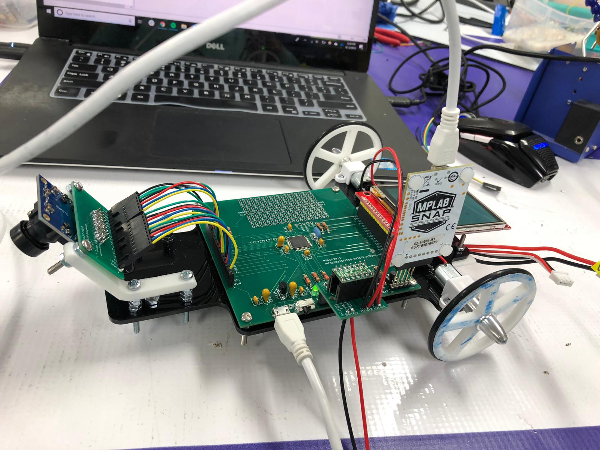

# ME 433 Assignments
ME 433: Advanced Mechatronics, Northwestern University, Spring 2019.

## Course Description
Embedded computing, software control of electromechanical systems, mechanical design and construction, sensors, actuators, digital and analog electronics. afsad

## Notable Demos
- Homework 5, using I2C to shine an LED when a button is pressed:

  
  
- Homework 6, drawing a progress bar on an LCD screen:

  

- Homework 7, drawing bars in four directions depending on gravitational force (inertial measurement unit):

  
  
- Homework 9, reading Z pressure and X and Y position on touchscreen:

  

- Homework 12, moving computer mouse by tilting circuit (communicates using USB):

  
  
- Homework 15, blinking lights using interrupts:

  
  
- Homework 16, line-following robot (built from scratch):

  
  
   
   
  
  
